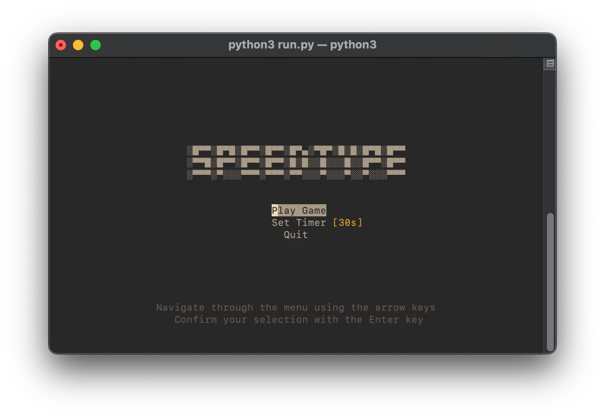
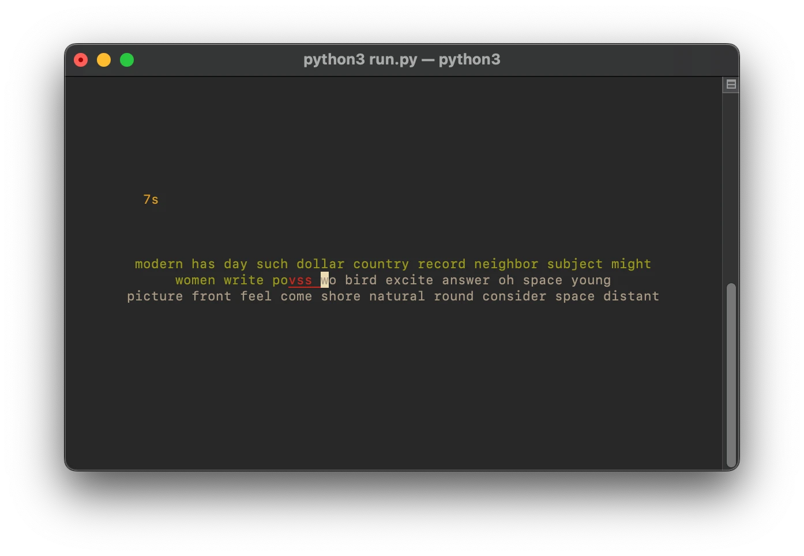
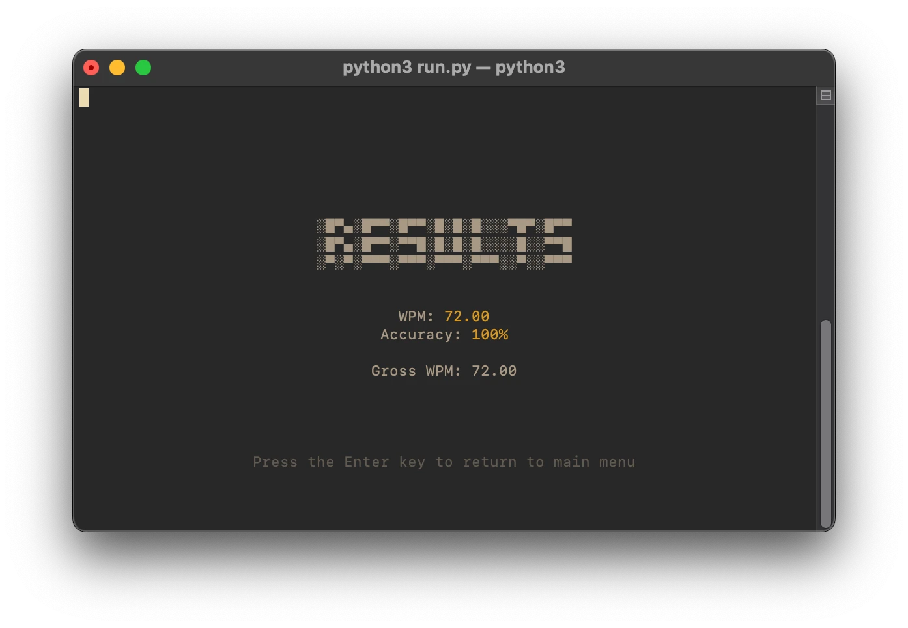
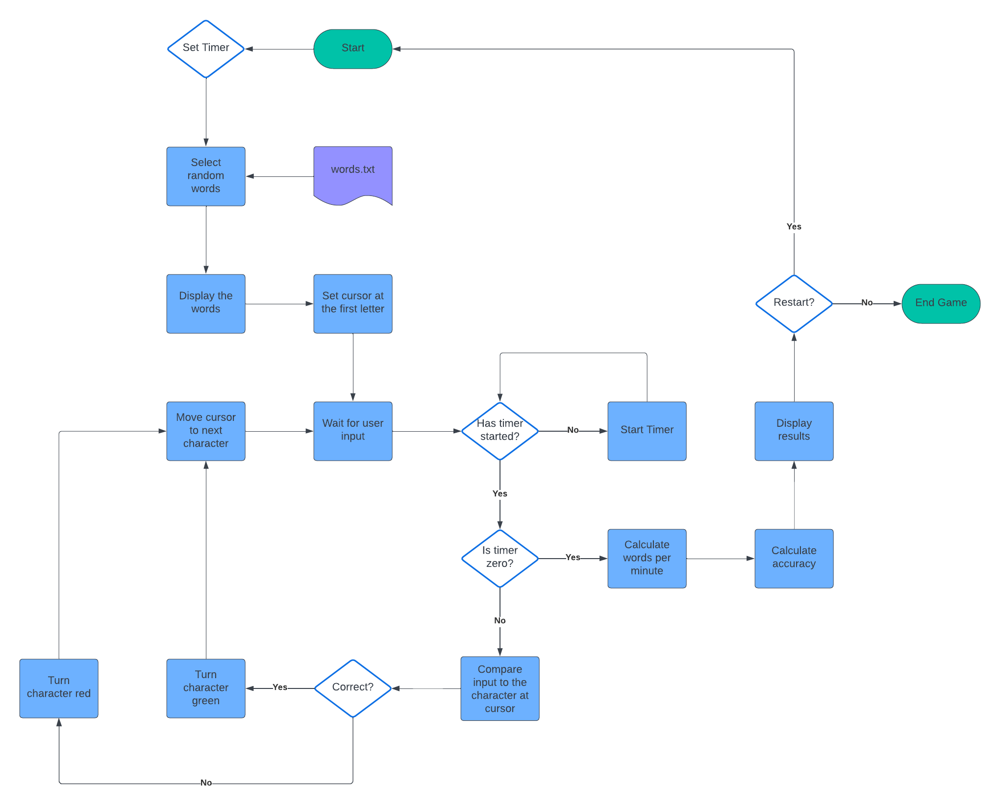
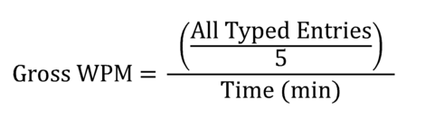
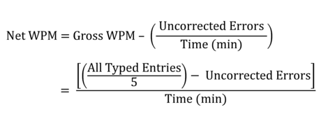
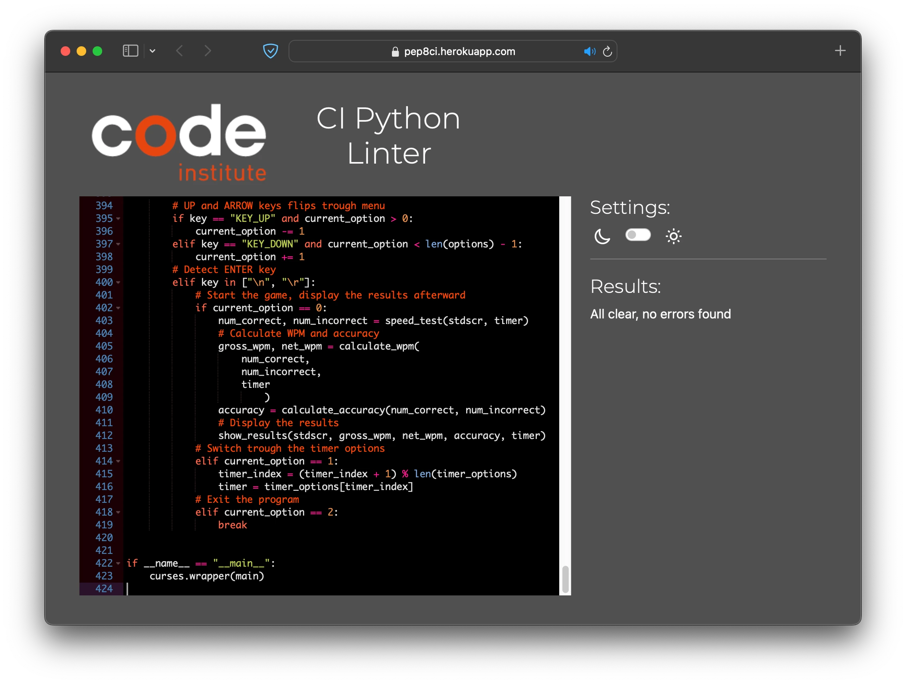

# SPEEDTYPE
\
[SPEEDTYPE](https://wpm-test-cf8ee303cbf2.herokuapp.com/) is a terminal-based typing test where you can practice and improve your typing speed. 
# Contents
- [**SPEEDTYPE**](#SPEEDTYPE)
- [User Stories](#user-stories)
- [Features](#features)
  - [Main Menu](#main-menu)
  - [Typing Test](#typing-test)
  - [Results](#results)
- [Development](#development)
    - [Project Inception and Flowchart](#project-inception-and-flowchart)
    - [Look and feel](#look-and-feel)
    - [Calculations](#calculations)
- [Testing](#testing)
    - [Validator Testing](#validator-testing)
    - [Manual Testing](#manual-testing)
    - [Automated Testing](#automated-testing)
- [Bugs](#bugs)
    - [Known Bugs](#known-bugs)
- [Technologues Used](#technologies-used)
    - [Languages](#languages)
    - [Libraries](#libraries)
- [Deployment](#deployment)
    - [Heroku](#heroku)
    - [Forking the GitHub repository](#forking-the-github-repository)
    - [Making a local clone](#making-a-local-clone)
- [Credits](#credits)
    - [Documentation and tutorials](#documentation-and-tutorials)
    - [Code](#code)
- [Acknowledgements](#acknowledgements)
## User Stories
- As a user, I want to quickly understand the game
- As a user, I want to select how long the game goes on.
- As a user, I want to easily see if I mispelled a word
- As a user, I want to correct my mistakes
- As a user, I want to see the result of my typing speed.
- As a user, I want to easily restart the game
## Features
### Main Menu

Here the user has three options to select between
1. Start the game
2. How long the test should last for
3. Exit
### Typing test

Here, the user is presented with rows of random words. The goal is to type as many as possible until the timer runs out. Letters are color-coded depending on whether the user types the correct character or not. New rows are presented as the user completes a row.
### Results

When the timer runs out, the results are shown, and the user has the option to return to the main menu. For more details about WPM and accuracy, see the [Calculations](#calculations) section.
## Development
### Project Inception and Flowchart
\
The project started by creating a flowchart to outline and visualize the basic mechanics. After that a fairly long period of trial and error, I especially struggled with matching the rows of words and user input lists with the cursor position. 
### Look and feel
One goal for the project was to have a modern and minimalistic aesthetic. To achieve that, I decided to use the curses library, which offers the flexibility to position text and utilize the whole screen. Curses also offers the ability to color text with decorations such as underlines.
### Calculations
The speed of typing is commonly measured in Words Per Minute (WPM).\
WPM is calculated using the following formula:
- Gross WPM:\
    
    >Gross, or Raw WPM (Words Per Minute) is a calculation of exactly how fast you type with no error penalties. The gross typing speed is calculated by taking all words typed and dividing by the time it took to type the words in minutes. 
    >When calculating typing speed, a "word" is any five characters. For instance, "I love keyboarding, don't you?" would be counted as 6 words (30 characters / 5) and not just 5. This makes sense because typing "deinstitutionalization" obviously should count more than typing "my". Spaces, numbers, letters, and punctuation are all included, but any function keys such as Shift or Backspace are **not** included
- Net WPM:\
    
    >Net WPM is argueably the most useful tool in gauging typing abilities. Since errors play a part in its calculation, it is more a measure of typing productivity than of just typing speed. In other words, a fast but error-prone typist will receive a lower net typing speed than a slower but more accurate typist - relatively speaking of course.
    >This makes sense because proof-reading and correcting errors takes up more time than simply typing a passage correctly in the first place. Less mistakes also means less chance for errors being missed during proof-reading and making their way into the final product.
- Accuracy:
    >Typing accuracy is defined as the percentage of correct entries out of the total entries typed. To calculate this mathematically, take the number of correct characters typed divided by the total number, multiplied by 100%. So if you typed 90 out of 100 characters correctly you typed with 90% accuracy.

[[SOURCE]](https://www.speedtypingonline.com/typing-equations)
 
## Testing
### Validator Testing

The code is validated using [CI Python Linter](https://pep8ci.herokuapp.com/#) with no errors or warnings.

### Manual Testing
| Element | Expected Behavior | Outcome |
| ------- | ------------------ | ------- |
| Main Menu | Shows at the beginning | Confirmed |
| Main Menu | Shows logo | Confirmed |
| Main Menu | Shows the instructions at the bottom | Confirmed |
| Main Menu | Shows the three menu options | Confirmed |
| Main Menu | UP and DOWN arrows navigate through the options | Confirmed |
| Main Menu | Pressing ENTER on the timer options changes the timer | Confirmed |
| Main Menu | Pressing ENTER on the Quit option exits the program | Confirmed |
| Main Menu | Pressing ENTER on the Start Game option starts the game | Confirmed |
| Game | Shows two rows of randomly selected words | Confirmed |
| Game | The cursor is on the first letter of the first word | Confirmed |
| Game | The timer is the one selected from the main menu | Confirmed |
| Game | The timer does not count down and is dimmed | Confirmed |
| Game | Shows the instructions at the bottom | Confirmed |
| Game | The timer starts when first button is pressed | Confirmed |
| Game | The timer is now not dimmed | Confirmed |
| Game | The instructions disappear once the timer starts | Confirmed |
| Game | The timer counts down regardless of user input | Confirmed |
| Game | The cursor moves the the right when input is entered | Confirmed |
| Game | The letter turns green if input is correct | Confirmed |
| Game | The letter turns red if input is incorrect | Confirmed |
| Game | The letter is highlighted with and underscore if input is incorrect | Confirmed |
| Game | The cursor moves the the left when backspace is pressed | Confirmed |
| Game | The letter turns white when backspacing | Confirmed |
| Game | When the last letter of the row is entered, the row moves up one position | Confirmed |
| Game | When row is complete the cursor moves back to the start | Confirmed |
| Game | When row is complete a new row of words are printed below | Confirmed |
| Game | When backspacing I can move back to the previous row | Confirmed |
| Game | The game ends when the timer reaches 0 | Confirmed |
| Results | Shows the RESULT logo | Confirmed |
| Results | Shows the results in the middle | Confirmed |
| Results | Shows the instructions at the bottom | Confirmed |
| Results | Pressing ENTER the Main menu is showed again | Confirmed |
| Error handling | The program exits if the terminal window is too small | Confirmed |
| Error handling | The program exits if the words.txt is not found | Confirmed |

### Automated Testing
To verify that the calculations are correct I set up automated tests using [pytest](https://docs.pytest.org/en/7.4.x/). These tests are in `test_run.py` under the `test` folder.

To install `pytest`, issue the command `pip3 install pytest`. Once the installation is complete run the command `pytest test`.

Results:
```sh
======================================= test session starts ========================================
platform darwin -- Python 3.11.6, pytest-7.4.3, pluggy-1.3.0
rootdir: .../CodeInstitute/CI_PP3
collected 2 items                                                                                  

test/test_run.py ..                                                                          [100%]

======================================== 2 passed in 0.01s =========================================
```

## Bugs
<details><summary>BUG: Rows are not separated by whitespace</summary>
The last word of one row and the first word of the next row are not separated by whitespace, making it easy to misspell. This was fixed by adding a whitespace at the end of the `get_random_string` function

```python
return " ".join(random.choice(words) for _ in range(length))
```
to
```python
return " ".join(random.choice(words) for _ in range(length)) + " "
```

</details>
<details><summary>BUG: When user presses TAB or the arrow keys it gets processed as a valid input.</summary>
The issue was resolved by running the input through the `.isprintable()` function

```python
        # Detect backspace
        if key in ["KEY_BACKSPACE", "\b", "\x7f"]:
            if len(user_input[pos]) > 0:
                user_input[pos] = user_input[pos][:-1]
            elif pos > 0:
                pos -= 1
                user_input[pos] = user_input[pos][:-1]
        else:
            # Add user input to the user_input list
            user_input[pos] += key
```
to:
```python
        # Detect backspace
        if key in ["KEY_BACKSPACE", "\b", "\x7f"]:
            if len(user_input[pos]) > 0:
                user_input[pos] = user_input[pos][:-1]
            elif pos > 0:
                pos -= 1
                user_input[pos] = user_input[pos][:-1]
        # Check if key is a printable character
        elif len(key) == 1 and key.isprintable():
            user_input[pos] += key
```

</details>
<details><summary>BUG: Shows incorrect coloring and text when the rows are shifted.</summary>
This was corrected by clearing the screen before moving the rows

```python        # Shift rows up and load a new row
        if len(user_input[1]) == len(rows[1]):
            # Clear the screen to avoid 
            stdscr.clear()
```

</details>
<details><summary>BUG: User can backspace into empty row</summary>
This happens if the user backspaces into the top row while that row is still empty.
To correct this, I added an extra condition to the backspace key.
From:

```python
elif pos > 0:
    # Move to the previous row
    pos -= 1
```
To:
```python
elif pos > 0 and rows[pos - 1]:
    # Move to the previous row
    pos -= 1
```

</details>
<details><summary>BUG: Old text stays on screen when it should have been removed</summary>
This could be resolved by using `stdscr.refresh()`, but this resulted in the cursor and text blinking at a high frequency. I opted to instead clear the rows of text and the timer before printing it out again.

From:
```python
for i in range(3):
    y_position = center_y - 1 + i
    x_position = center_x if i == 1 else (max_x - len(rows[i])) // 2
    stdscr.addstr(y_position, x_position, rows[i])

# Display the remaing time
if start_time:
    remaining_time = max(int(end_time - time.time()), 0)
else:
    remaining_time = timer_length
stdscr.addstr(y_position - 5,  max_x // 2 - 30, str(f"{remaining_time}s"), curses.color_pair(3))
```
To:
```python
for i in range(3):
    y_position = center_y - 1 + i
    x_position = center_x if i == 1 else (max_x - len(rows[i])) // 2
    # Clear the row before printing
    stdscr.addstr(y_position, 0, " " * max_x)
    # Print the row
    stdscr.addstr(y_position, x_position, rows[i])

# Display the remaing time
if start_time:
    remaining_time = max(int(end_time - time.time()), 0)
else:
    remaining_time = timer_length
# Clear the text before printing
stdscr.addstr(y_position - 5, 0, " " * max_x)
# Print the timer
stdscr.addstr(y_position - 5,  max_x // 2 - 30, str(f"{remaining_time}s"), curses.color_pair(3))
```

</details>
<details><summary>BUG: ZeroDivisionError in calculate_accuracy function</summary>
This occurred when no characters were typed in and the calculate_accuracy function tried to divide by zero.
To prevent this, I added this check before the division:

```python
if all_chars == 0:
    return 0
```

</details>
<details><summary>BUG: curses.error: curs_set() returned ERR when deployed on Heroku</summary>

This bug occurred when the project was deployed on Heroku. According to this [Bug Report](https://github.com/isontheline/pro.webssh.net/issues/709) there's a problem with certain terminal settings and hiding the cursor. Since it doesn't seem like I can change the terminal settings in Heroku, I did a workaround to hide the cursor behind the highlighted option in the main menu.

```python
# Hide the cursor behind the highlighted menu option
cursor_y = center_y + current_option
cursor_x = center_x - len(options[current_option]) // 2
stdscr.move(cursor_y, cursor_x)
```

</details>
<details><summary>BUG: Cursor is sometimes on the wrong position on a new row</summary>
This bug occurred because the way the position of the rows of text and the position of the cursor were
calculated separately, and it was not certain that the calculations came up with the same result.

To fix this, I saved the row's starting position in a list and used that as the cursor's starting position.
```python
# Keep track of the row starting positions
start_pos = []
# Display rows of text
for i in range(3):
    y_offset = i - 1
    x_pos = scr.row(0, y_offset, rows[i])
    start_pos.append(x_pos)
# Calculate center positions
max_y, max_x = stdscr.getmaxyx()
center_y = max_y // 2

# Move cursor position
cursor_x = start_pos[pos_y] + len(entry[pos_y])
cursor_x = min(cursor_x, max_x - 1)
cursor_y = center_y - 1 + pos_y
stdscr.move(cursor_y, cursor_x)
```

</details>
<details><summary>BUG: Cursor is on the wrong position when backspacing back to the top row</summary>
This bug occurred in how I implemented the row positioning and how the python len() function works. Basically, it adds an extra whitespace at the end of the row, to fix this, I simply remove that trailing whitespace.

```python
# Move the cursor to the top row
elif pos_y > 0 and entry[pos_y - 1]:
    pos_y -= 1
    entry[pos_y] = entry[pos_y].rstrip()
    pos_x = len(entry[pos_y])
```

</details>

### Known Bugs
No known bugs remaining.

## Technologies used
- IDE: Microsoft VS Code
- Repository: GitHub
- Deployment: Heroku
- Flowchart: [Lucidchart](https://www.lucidchart.com/pages/sv)
- ASCII Art Generator: [asciiart](https://www.asciiart.eu/text-to-ascii-art)
### Languages
- Python
### Libraries
- [Curses](https://docs.python.org/3/howto/curses.html)
    - Curses is used to print everything to the screen, allowing positioning of the text and its color.
- [Random](https://docs.python.org/3/library/random.html)
    - The random library is used to randomize the presented words from words.txt
- [Time](https://docs.python.org/3/library/time.html)
    - Time library is used to keep track of the timer

## Deployment
### Heroku
[Click here to go to the deployed site](https://wpm-test-cf8ee303cbf2.herokuapp.com/)\
The site was deployed to Heroku pages. The steps to deploy a site are as follows:
1. Navigate to [Heroku](https://dashboard.heroku.com/apps)
2. Click on "New", then "Create new app"
3. Enter the app name, select your region, and click on "Create app"
4. Navigate to the "Settings" tab
5. Click on "Add buildpack", select "Python", and click on "Add Buildpack"
6. Click on "Add buildpack" again, this time select "nodejs", and click on "Add Buildpack"
7. Navigate to the "Deploy" tab
8. In the "Deployment method" section, select "GitHub"
9. In the "Connect to GitHub" section, select "Search"
10. Find the desired repository, for this project I used "CI_PP3", and click "Connect"
11. Click on either "Enable Automatic Deploys" or "Deploy Branch"
12. Once the project has been deployed, scroll up and click on "Open app"

### Forking the GitHub Repository
By forking the GitHub Repository, we make a copy of the original repository on our GitHub account to view and/or make changes without affecting the original repository by using the following steps:
1. Log in to GitHub and locate the [GitHub Repository](https://github.com/dvudd/CI_PP3)
2. At the top of the Repository (not top of the page) just above the "Settings" Button on the menu, locate the "Fork" Button.
3. You should now have a copy of the original repository in your GitHub account.
### Making a Local Clone
1. Log in to GitHub and locate the [GitHub Repository](https://github.com/dvudd/CI_PP3)
2. Under the repository name, click "Clone or download".
3. To clone the repository using HTTPS, under "Clone with HTTPS", copy the link.
4. Open Git Bash
5. Change the current working directory to the location where you want the cloned directory to be made.
6. Type `git clone`, and then paste the URL you copied in Step 3.
```sh

$ git clone https://github.com/dvudd/CI_PP3

```
7. Press Enter. Your local clone will be created.
8. Open `run.py` with python.
```sh

$ python3 run.py

```
Note: If you are using windows you need to install curses:
```sh
$ pip install windows-curses
```
## Credits

### Documentation and Tutorials
- [Python Documentation](https://docs.python.org/3/library/curses.html)
    - [isprintable](https://docs.python.org/3/library/stdtypes.html?highlight=isprintable#str.isprintable)
    - [getmaxyx](https://docs.python.org/3/library/curses.html?highlight=getmaxyx#curses.window.getmaxyx)
    - [nodelay](https://docs.python.org/3/library/curses.html#curses.window.nodelay)
    - [refresh](https://docs.python.org/3/library/curses.html#curses.window.refresh)
    - [endwin](https://docs.python.org/3/library/curses.html#curses.endwin)
- [Python HowTo](https://docs.python.org/3/howto/curses.html)
    - [Attributes and Color](https://docs.python.org/3/howto/curses.html#attributes-and-color)
- Python Curses Tutorial: [Tech With Tim](https://www.youtube.com/watch?v=Db4oc8qc9RU&list=PLzMcBGfZo4-n2TONAOImWL4sgZsmyMBc8)
- 1000 most common words: [GitHub](https://github.com/powerlanguage/word-lists)
- WPM Calculations: [speedtypingonline.com](https://www.speedtypingonline.com/typing-equations)
### Code
- Handle file not found: [StackOverflow](https://stackoverflow.com/questions/22366282/python-filenotfound)
- Get screen size: [StackOverflow](https://stackoverflow.com/questions/53019526/get-updated-screen-size-in-python-curses)
- Detect backspace: [StackOverflow](https://stackoverflow.com/questions/47481955/python-curses-detecting-the-backspace-key)

### Acknowledgements	
- Thank you to my mentor Jack Wachira.\
\
This is my Portfolio Project 3 as part of the Full Stack Software Developer program at [Code Institute](https://codeinstitute.net/).\
David Eriksson 2023